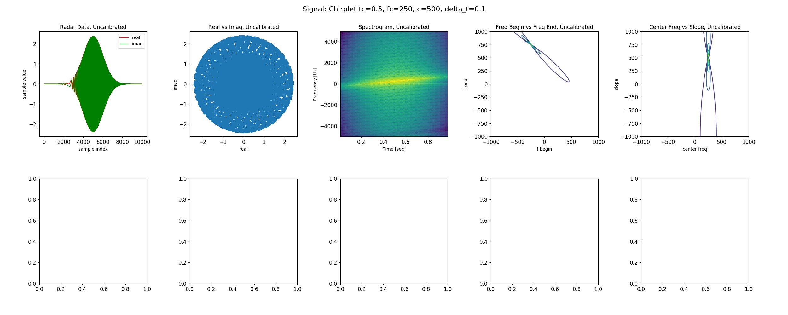
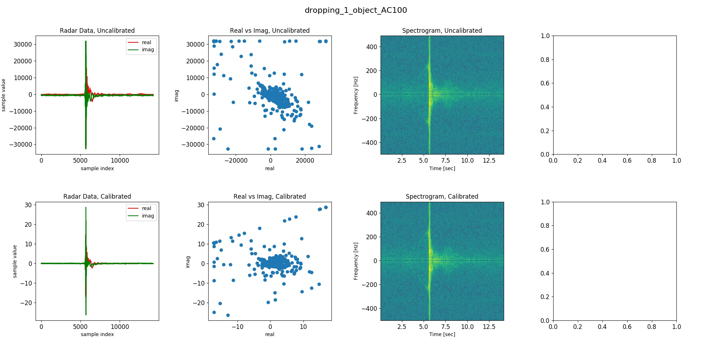

# HDR Radar Data Analysis

The pictures below are organized as follows:

- top row: results using radar data without calibration or toy data
- bottom row: results using radar data with calibration

- column 1: plot of the real and imaginary part to the samples
- column 2: correlation between real and imaginary data
- column 3: spectrogram
- column 4: Freq-Freq plot with chirplet expansion (Figure 7 left in this paper: http://wearcam.org/chirplet.pdf)
- column 5: Slope-Center Freq plot with chirplet expansion (Figure 6 left in this paper: http://wearcam.org/chirplet.pdf)

## Toy data:
- the data is sampled from a chirplet between `t=0 to 1` with sample frequency `1e4`. The chirplet parameters are shown in the title. Refer to Equation 3 in this paper: http://wearcam.org/chirplet.pdf.
- the result looks good to me.

## Dropping 1 object data

- the spectrogram uses log-scale intensity.
- There's a huge peak in the dataset, and seems like the spectrogram only shows some frequency intensity there. Did not see a slope in the spectrogram

